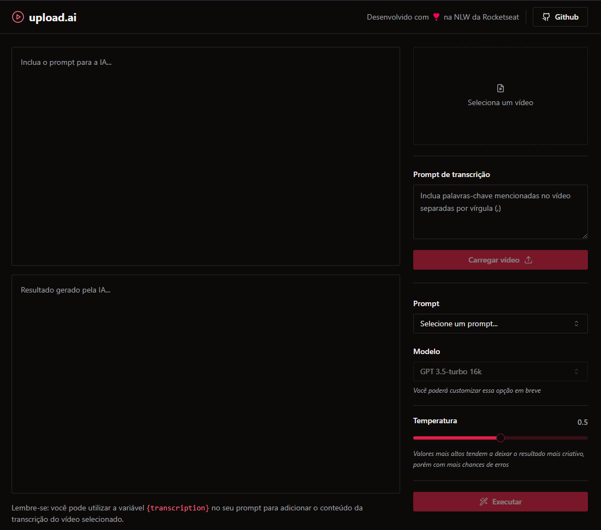

# Upload Video AI

## Descrição

Faça upload de um vídeo e gere um conteúdo customizado pela IA da OpenAI, contendo sua transcrição como base, podendo selecionar prompts já formatados para Título ou Descrição do Youtube.

## Tecnologias

### Front-end

- [Vite][vite]
- [Typescript][typescript]
- [TailwindCSS][tailwindcss]
- [Shadcn/ui][shadcn_ui]
- [Radix UI][radix]
- [Lucide-react][lucide]
- [Zod][zod]

### Back-end

- [Fastify][fastify]
- [Vercel AI SDK][vercel_ai]
- [Prisma][prisma]
- [ffmpeg.wasm][ffmpeg]
- [OpenAI][openai]

[vite]: https://vitejs.dev
[vercel_ai]: https://github.com/vercel/ai
[ffmpeg]: https://github.com/ffmpegwasm/ffmpeg.wasm
[openai]: https://openai.com
[fastify]: https://fastify.dev
[typescript]: https://www.typescriptlang.org
[prisma]: https://www.prisma.io
[tailwindcss]: https://tailwindcss.com
[shadcn_ui]: https://ui.shadcn.com
[radix]: https://www.radix-ui.com
[lucide]: https://lucide.dev
[zod]: https://zod.dev

## Créditos

Feito no evento NLW IA, oferecido pela [Rocketseat](https://www.rocketseat.com.br)
